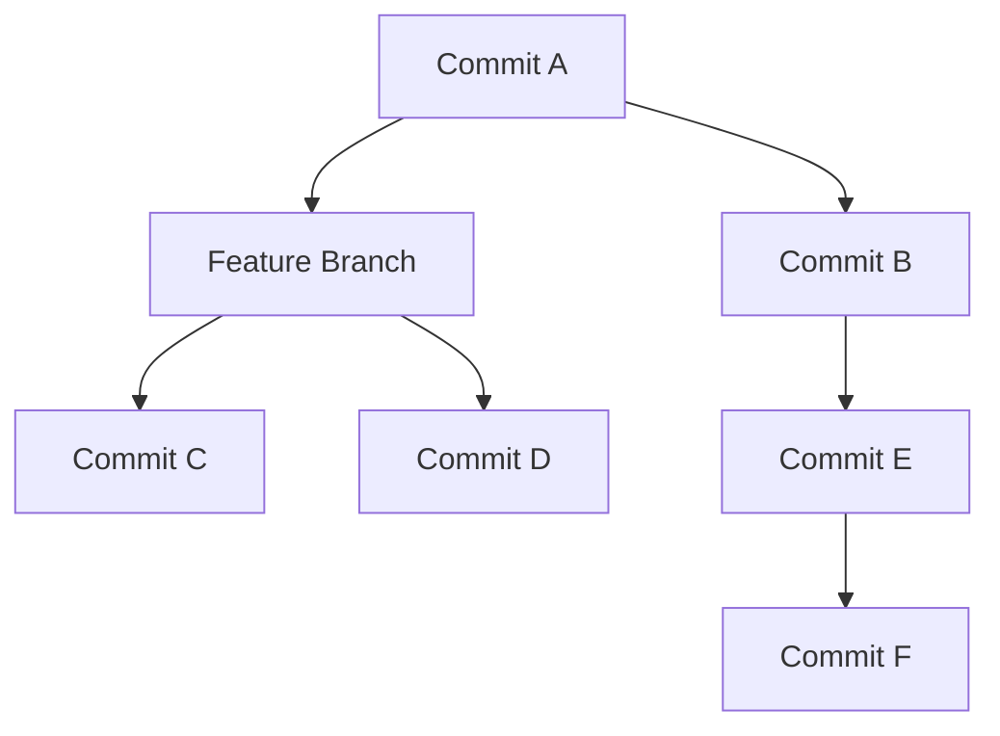

# Branches

**Branches are labels on commits.** They allow multiple lines of development to occur in parallel, making it easier to experiment and manage features or fixes separately.

Checking out a branch passes the HEAD label to that commit, which means that any new commits you make will be positioned on the branch you are currently on.

### Basic Branching Structure

This chart illustrates a basic branch structure, showing how different branches diverge from a common commit:

