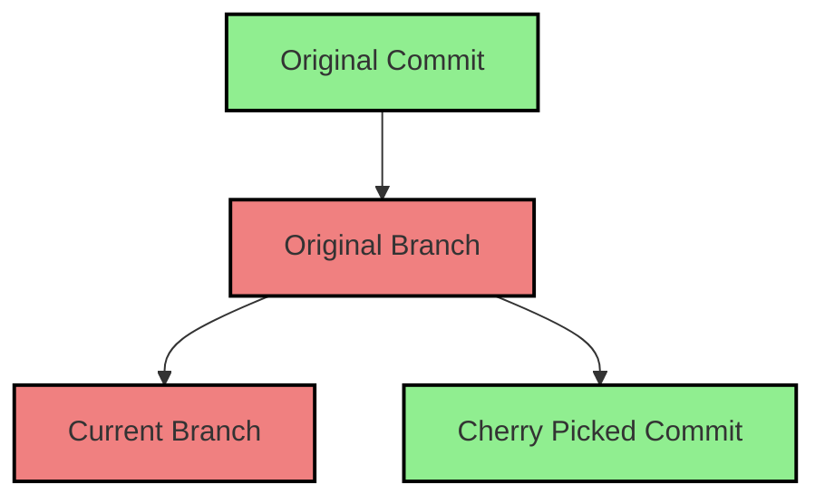

# Cherry Pick

Cherry picking is a Git command that allows you to apply the changes introduced by specific commits from one branch onto another branch. This is useful when you want to apply a particular change without merging the entire branch.

### Use Cases

- **Selective Changes**: When you want to bring specific features or bug fixes from one branch to another without merging all commits.
- **Hotfixes**: You may need to apply a bug fix from a development branch directly to the master branch while keeping the other changes in the development branch.

### How Cherry Picking Works

When you cherry pick a commit, Git will create a new commit that applies the changes made in the picked commit to your current branch.

