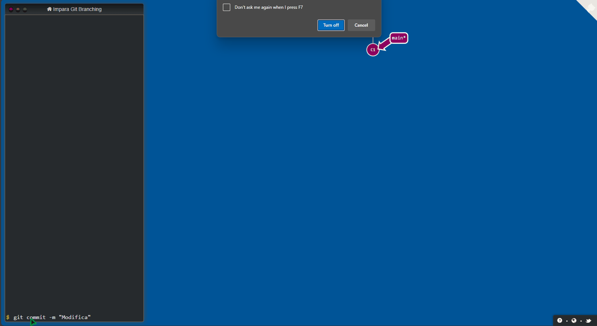

# Basic Commands

In Git, there are several fundamental commands that every user should know to effectively manage their repositories. This page outlines some of the essential commands and their functionalities.

#### Here is a little animation to demonstrate some concepts we are going to explain in the next pages:



## 1. git init

Creates a new Git repository.

```bash
# Initialize a new Git repository
git init
```

## 2. git clone

Copies an existing repository to your local machine.

```bash
# Clone a repository from a remote source
git clone <repository-url>
```

## 3. git add

Adds changes in your working directory to your staging area.

```bash
# Stage changes for the next commit
git add <file>
```

## 4. git commit

Records the staged changes in the repository.

```bash
# Commit the staged changes
git commit -m "Commit message"
```

## 5. git status

Displays the state of the working directory and the staging area.

```bash
# Show the status of changes
git status
```

## 6. git push

Uploads local repository content to a remote repository.

```bash
# Push changes to the remote repository
git push <remote> <branch>
```

## 7. git pull

Fetches and merges changes from a remote repository to your local repository.

```bash
# Pull changes from the remote repository
git pull <remote> <branch>
```

## 8. git branch

Lists, creates, or deletes branches.

```bash
# List all branches
git branch
```

We are now going to do a deep-dive into the other commands in the next pages.