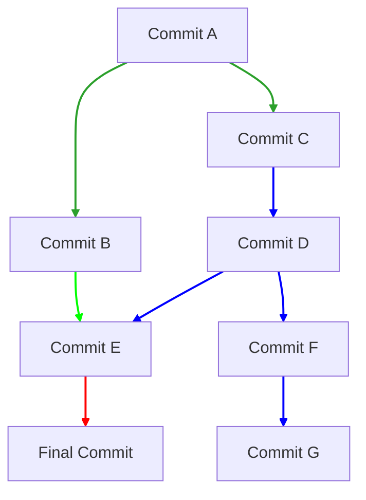

# Commit

It is a **package** containing *tree* and *blob*, and it retains the changes we do to one or more project's files.

Git calculates a hash for every commit, used for its identification (the comment we attach to the commit is not unique).

* Commits create the ***directed acyclic graph*** of our history:
    - Each commit remembers which commit came before it (a merge commit points to two previous commits)
* A commit is a snapshot of the state of your files, with some *metadata*, informations about it contents, authors and date.
*  Each commit has a ***pointer*** to the previous one/s, and that pointer makes it **unique**.

### Directed Acyclic Graph (DAG) of Commits

This chart shows a more complex DAG structure typical in Git repositories:

