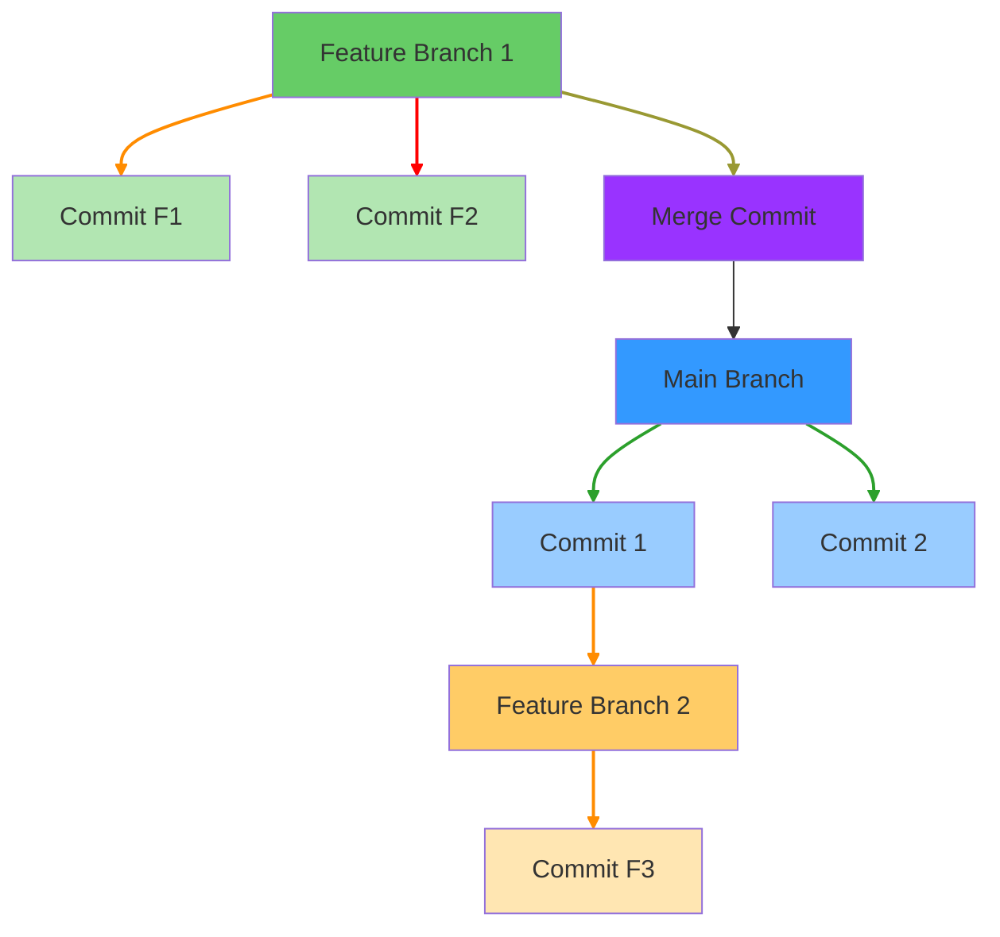
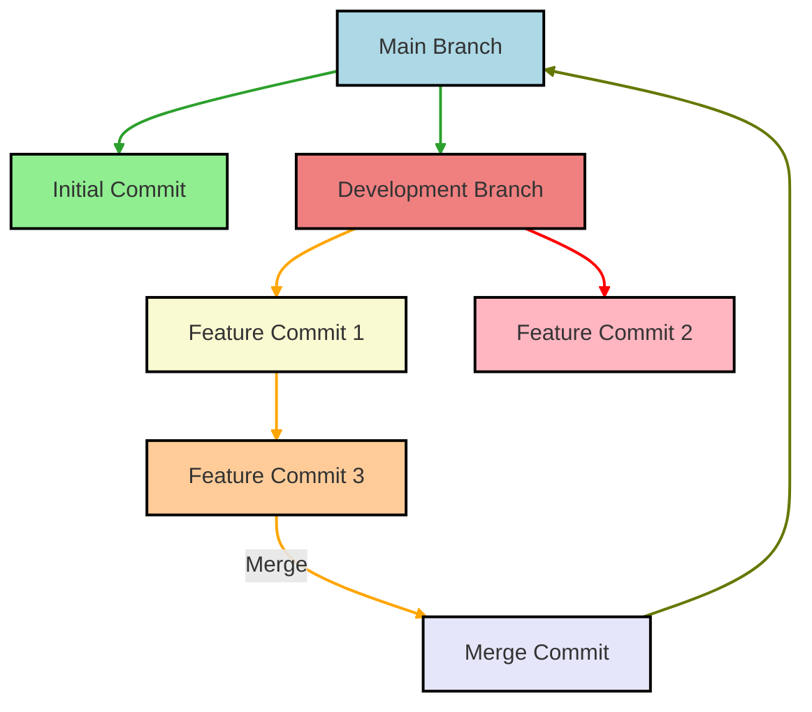

# Managing branches

#### Creating a new branch locally

To create a new branch and switch to it, use the following command:

```bash
git checkout -b [branch-name]
```

This command creates a new branch in your local repository, and switches to it by updating the index and the files in the working tree.

#### Pushing the new branch remotely

Once you've completed your work, commit the changes, and push them to your remote repository:

```bash
git add -A
git commit -m "commit message"
git push -u origin [branch-name]
```

The `-u` flag sets the upstream for the branch, allowing you to use `git push` and `git pull` without explicit arguments in the future.

#### Deleting a branch locally

To delete a local branch that you no longer need, use:

```bash
git branch -d [branch-name]
```

If the branch has unmerged changes, you can forcefully delete it using:

```bash
git branch -D [branch-name]
```

#### Deleting a branch remotely

To delete a branch from the remote repository, use:

```bash
git push origin --delete [branch-name]
```

#### Renaming a branch

To rename a branch while you are on it, use:

```bash
git branch -m [new-branch-name]
```

To rename a branch while you are not on it, use:

```bash
git branch -m [old-branch-name] [new-branch-name]
```

#### Merging branches

To merge changes from one branch into another, switch to the branch you want to merge into and run:

```bash
git merge [branch-name]
```

This chart illustrates how branches can be merged back into a main branch:



**Example:**
If you want to merge the `develop` branch into the `master` branch, first check out the `master` branch:

```bash
git checkout master
git merge develop
```

Optionally, you may choose to delete the feature branch after merging:

```bash
git branch -d develop               # Delete the local `develop` branch
git push origin --delete develop    # Delete the remote `develop` branch
```

### Feature Development and Final Merge

This chart represents the process of developing a feature branch and merging it into the main branch:


1. **Keep Branches Short-Lived:** Branches should be focused and merged back into the main line of development (often `main` or `master`) as soon as possible.

2. **Use Descriptive Names:** Branch names should convey the purpose (e.g., `feature/login`, `bugfix/header-bug`) to make collaboration easier.

3. **Regularly Pull Changes:** If working in a team, make sure to regularly pull changes from the main branch into your feature branches to minimize merge conflicts.

4. **Rebase vs. Merge:** If you want to maintain a clean project history, consider using `git rebase` instead of `git merge`. This linearizes the commit history.

5. **Use Pull Requests (PR):** When collaborating, use PRs to review code before merging it into the main branch to ensure code quality and maintainability.

By following these practices, you can effectively manage branches in Git and maintain a clean history of your project's development.

