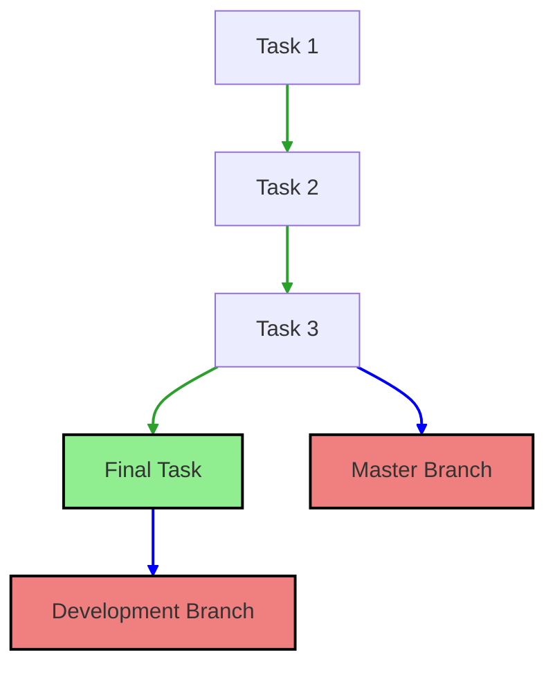
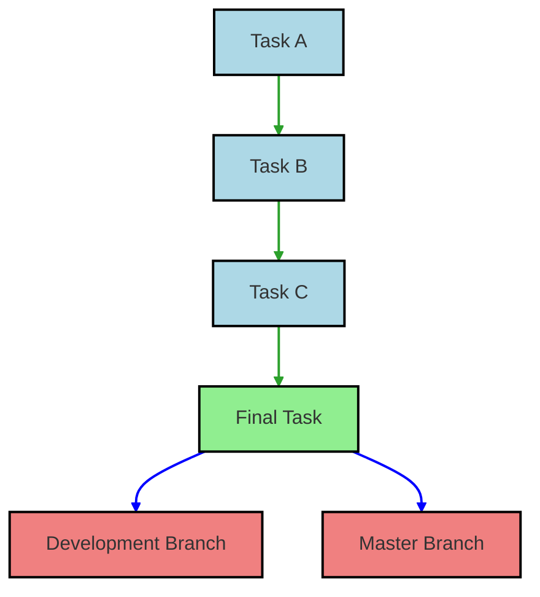
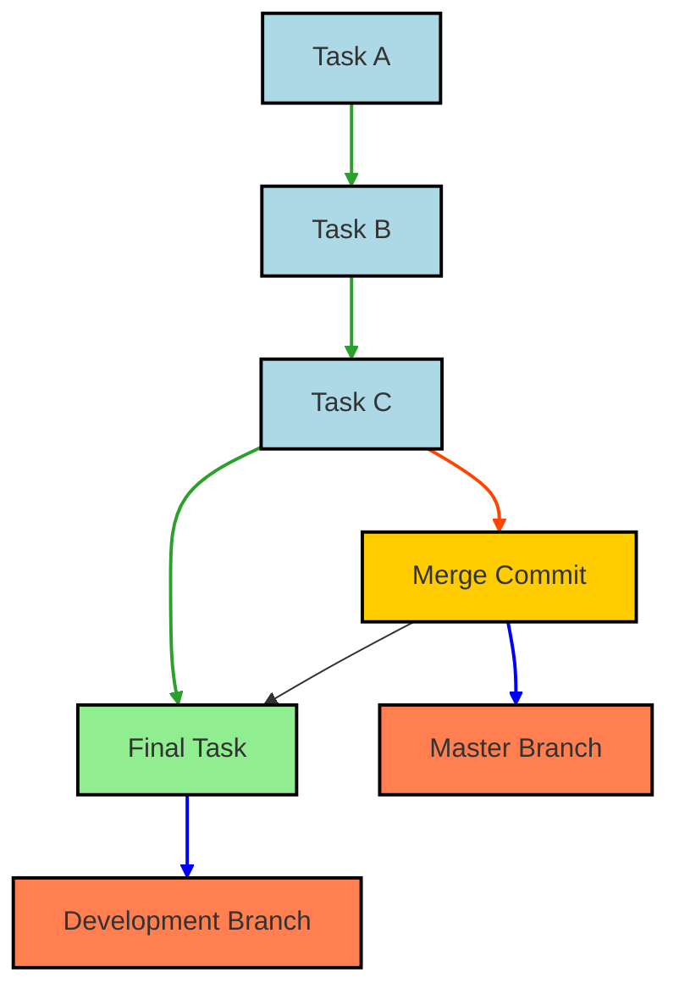

# Merge

This document explains the concept of fast forward and no fast forward merges in Git, as illustrated in the provided diagram.

## Explanation

### Initial State

Initially, we have two branches: `master` and `dev`.



### Fast Forward Merge

When the `master` branch is merged into the `dev` branch and there are no new commits in the `master` branch, we can perform a fast forward merge. This will move the `master` branch pointer to the latest commit in the `dev` branch.



### No Fast Forward Merge

If there are new commits in the `master` branch, a merge commit is created to combine the histories of the `master` and `dev` branches. This results in a no fast forward merge.



## Commands

To perform a fast forward merge:

```bash
# Switch to master branch
git checkout master

# Merge dev branch into master
git merge dev
```

Optionally, you may choose to delete the feature branch after merging:

```bash
git branch -d dev               # Delete the local `develop` branch
git push origin --delete dev    # Delete the remote `develop` branch
```


To ensure no fast forward merge:

```bash
# Switch to master branch
git checkout master

# Merge dev branch into master with no fast forward option
git merge --no-ff dev
```

## Summary

- **Fast Forward Merge**: Moves the branch pointer forward without creating a new commit.
- **No Fast Forward Merge**: Combines branch histories and creates a new merge commit.