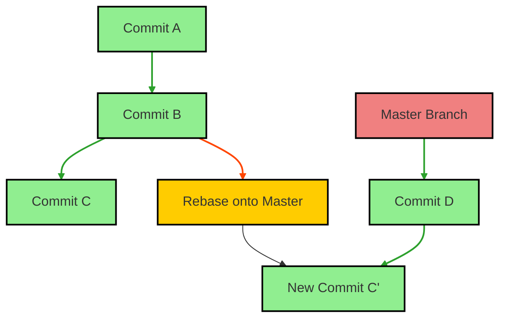
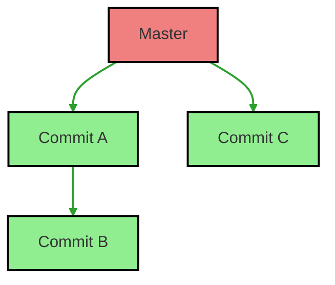
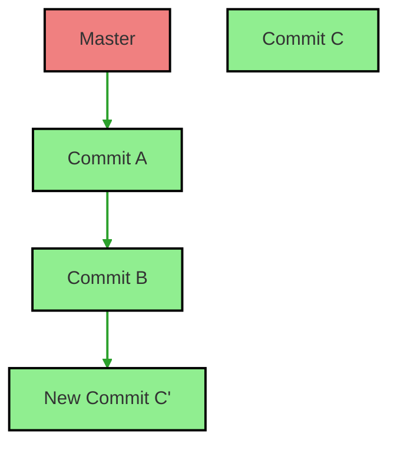

# Rebase

Rebasing is a powerful feature in Git that allows you to integrate changes from one branch into another. This document explains how to rebase and provides visual diagrams to illustrate the process.

## What is Rebase?

Rebasing involves moving or combining a sequence of commits to a new base commit. This results in a linear project history and can help simplify merge conflicts.

### How Rebase Works

When you rebase a branch onto another, Git replays the commits from your current branch on top of the specified branch.



### Example Rebase

1. Assume you have a feature branch `dev` based on `master`. The commits look like this:



2. If you want to rebase your `dev` branch onto `master`, after running `git rebase master`, the history would look like:



### Commands

To perform a rebase:

```bash
# Start rebasing onto another branch
git rebase <branch>
```

For example:

```bash
# Rebase dev branch onto master
git rebase master
```

To continue the rebase after resolving conflicts:

```bash
git rebase --continue
```

To abort the rebase process:

```bash
git rebase --abort
```

### Handling Conflicts

During rebasing, if you encounter conflicts, you'll need to resolve them manually. Once you've fixed the conflicts, use the commands above to continue or abort the rebase.

### Summary

- **Rebase**: Moves or combines commits to a new base commit for a linear history.
- **Commands**: `git rebase <branch>`, `git rebase --continue`, `git rebase --abort`.
- **Conflict Resolution**: Similar to merging, requires manual intervention in case of conflicts.


