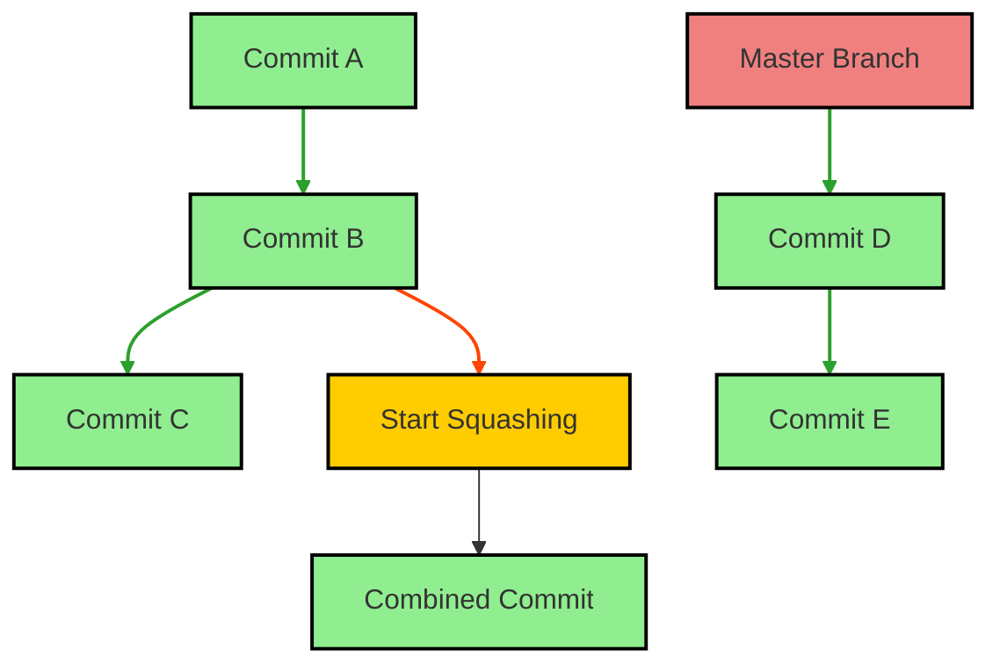
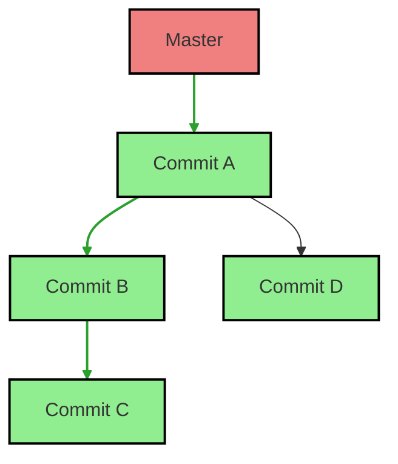

# Squash

Squashing is a Git feature that allows you to combine multiple commits into a single commit. This is often used to create a cleaner project history before merging changes.

## What is Squash?

Squashing combines two or more consecutive commits into one, which helps to simplify the commit history and makes it easier to understand the changes made.

### How Squash Works

When you squash commits, Git will compress the selected commits into a single commit. You can do this using an interactive rebase.



### Example Squash

1. Assume you have the following commits in your `dev` branch:



2. To squash the last two commits into one, initiate an interactive rebase:

```bash
# Start interactive rebase for the last 3 commits
git rebase -i HEAD~3
```

3. In the editor that opens, change the command for the last commit from `pick` to `squash` or `s`:

```plain text
pick <commit-hash-A> Commit A
pick <commit-hash-B> Commit B
squash <commit-hash-C> Commit C
```

4. After saving and exiting, Git will prompt you to edit the commit message for the new combined commit.

### Commands

To perform a squash:

```bash
# Start an interactive rebase
git rebase -i HEAD~<number-of-commits>
```

For example:

```bash
# Squash the last 3 commits
git rebase -i HEAD~3
```

### Summary

- **Squash**: Combines multiple commits into a single commit for a cleaner history.
- **Commands**: `git rebase -i HEAD~<number>`, followed by adjusting commit actions in the editor.
