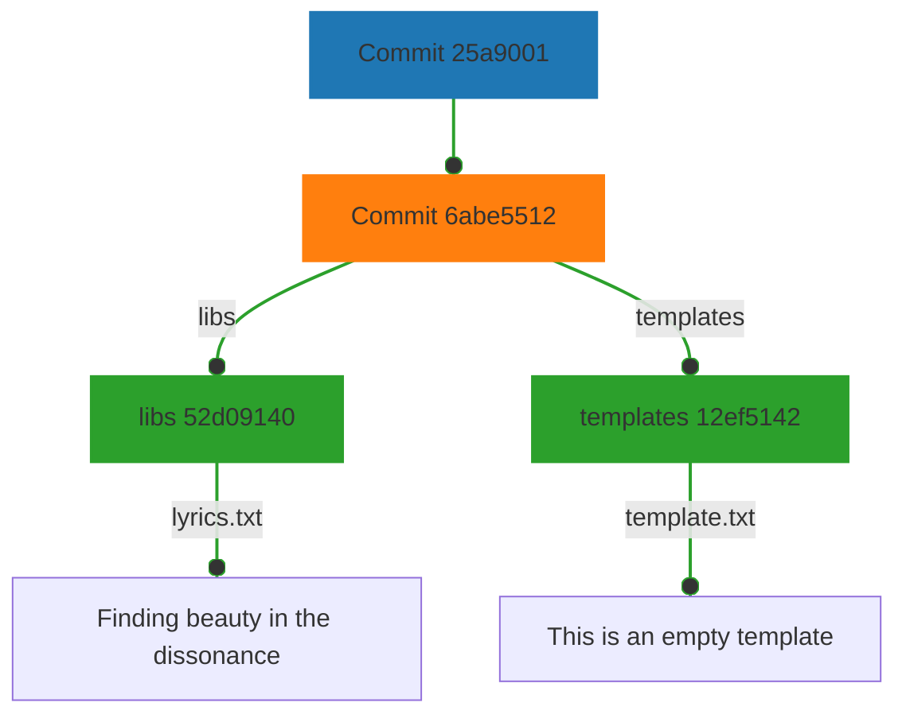
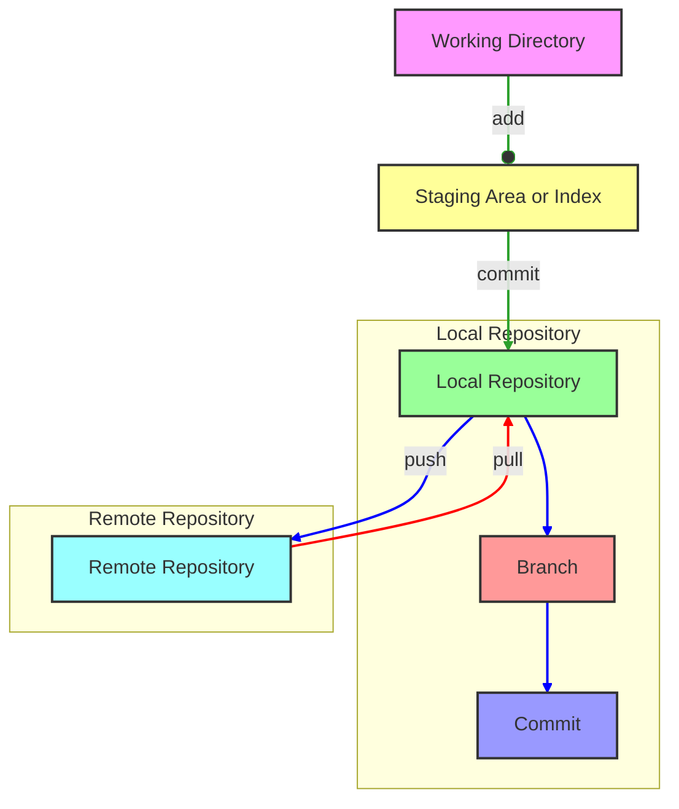

# Structure

We could see ***git*** as a database, holding couples *key/value*, where:

- **Tree** (as a unix-like system directory tree)
- **Blobs** (comparable to files)
- **Commit**
- **Tags**

Here we can see how every "block" has a corresponding *label*: we refer to these labels as **tags**.

