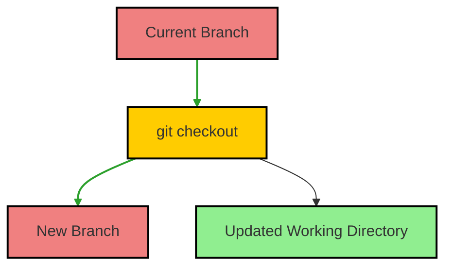
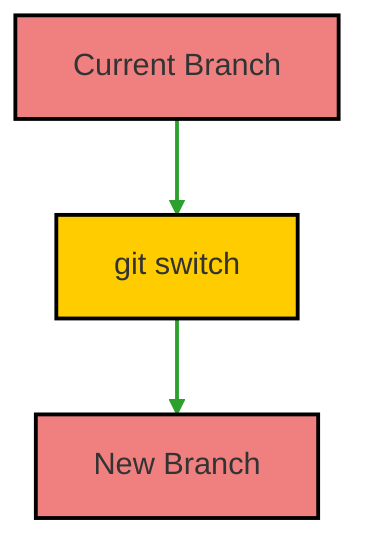

# Git Switch vs. Checkout: What's the Difference?

In Git, the commands `checkout` and `switch` are used for moving between branches or checking out different commits. However, their usage and implications are different. This page discusses these two commands, their functionalities, and outlines when to use each.

## What is Git Checkout?

The `git checkout` command is a versatile command that serves multiple purposes, including:

1. Switching to a different branch.
2. Creating a new branch from the current branch.
3. Restoring files in your working directory.

### How Checkout Works

When you use `git checkout <branch>`, Git updates the working directory and the index to match the specified branch, allowing you to start working on it.

## What is Git Switch?

Introduced in Git 2.23, the `git switch` command is specifically designed for switching branches and is intended to make the behavior clearer. It simplifies the process of moving between branches.

### How Switch Works

When you use `git switch <branch>`, it focuses solely on changing the current branch, without the additional functionalities that `checkout` provides.

## Key Differences

### Functions

- **git checkout**: 
  - Can switch branches.
  - Can create new branches.
  - Can restore files from a different commit.

- **git switch**:
  - Only designed for switching branches.
  - Does not restore files or create branches.

### Usage

- Use `git checkout` when you want more versatility or need to restore files.
- Use `git switch` when you simply want to change branches and prefer a clearer command.

## Summary

- **Git Checkout**: A multipurpose command for switching branches, creating branches, and restoring files.
- **Git Switch**: A focused command for switching branches, introduced for clarity and simplicity.
- **Recommendation**: Prefer `git switch` for changing branches to enhance command readability, while using `git checkout` for more complex tasks.
